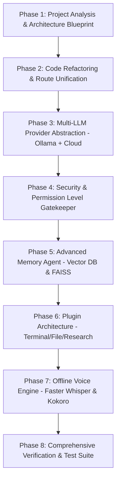

# ULTRON AI OPERATING SYSTEM — PROJECT ANALYSIS & SYSTEM BLUEPRINT

**Version**: 2.0 (Production Grade Audit)  
**Target System**: Tony Stark JARVIS-Inspired AI OS  

---

## 1. System Architecture Diagram

```
                              ┌────────────────────────────────────────┐
                              │            USER INTERFACE              │
                              │  - PyWebView Native App (desktop_app)  │
                              │  - Web Interface (frontend/index.html) │
                              │  - Sci-Fi 3D Canvas (sphere.js)        │
                              └───────────────────┬────────────────────┘
                                                  │ (HTTP / SSE Stream)
                                                  ▼
                              ┌────────────────────────────────────────┐
                              │           FASTAPI BACKEND              │
                              │           (backend/main.py)            │
                              └───────────────────┬────────────────────┘
                                                  │
       ┌────────────────────────┬─────────────────┼──────────────────┬────────────────────────┐
       ▼                        ▼                 ▼                  ▼                        ▼
┌──────────────┐      ┌──────────────────┐  ┌───────────┐   ┌────────────────┐      ┌───────────────────┐
│ MULTI-LLM    │      │  COGNITIVE       │  │ MEMORY    │   │ VOICE ENGINE   │      │ DOCUMENT & VISION │
│ ROUTER       │      │  PLANNER         │  │ ENGINE    │   │ - Edge-TTS     │      │ - PyTesseract     │
│ - NVIDIA     │      │ - parse_plan()   │  │ - SQLite  │   │ - SpeechT5     │      │ - Groq Vision     │
│ - Gemini     │      │ - Action Schemas │  │ (user     │   │ - Groq Whisper │      │ - Gemini Vision   │
│ - Groq       │      └────────┬─────────┘  │  facts)   │   └────────────────┘      └───────────────────┘
└──────────────┘               │            └───────────┘
                               ▼
                      ┌──────────────────┐
                      │ AGENT EXECUTOR   │
                      │ (executor.py)    │
                      └────────┬─────────┘
                               │
            ┌──────────────────┴──────────────────┐
            ▼                                     ▼
┌───────────────────────┐             ┌───────────────────────┐
│ BROWSER AGENT         │             │ DESKTOP AGENT         │
│ (browser_agent.py)    │             │ (desktop_agent.py)    │
│ - Playwright Chromium │             │ - pywinauto / Win32   │
│ - Storage State      │             │ - Start Menu Indexer  │
│ - Vision Smart Task   │             │ - PyAutoGUI / Direct  │
└───────────────────────┘             └───────────────────────┘
```

---

## 2. Dependency Graph

```
desktop_app.py
  └── backend/main.py
        ├── backend/planner.py
        ├── backend/executor.py
        │     ├── backend/desktop_agent.py (pywinauto, win32gui, pyautogui, pydirectinput, winreg)
        │     └── backend/browser_agent.py (playwright async chromium)
        ├── backend/routers/
        │     ├── tts.py (edge_tts, speecht5, librosa, torch)
        │     ├── stt.py (groq whisper)
        │     ├── ocr.py (pytesseract, PIL)
        │     ├── chat.py
        │     └── translate.py (deep-translator)
        └── backend/services/
              ├── llm.py
              └── whisper.py
```

---

## 3. Existing Features Audit

| Feature Category | Implementation File | Status | Description |
| :--- | :--- | :--- | :--- |
| **Native Desktop App** | [desktop_app.py](file:///c:/Users/nisha/Downloads/ultron-translate-FIXED%20%282%29/ultron-translate/desktop_app.py) | Working | PyWebView container with system tray icon (`pystray`) and always-on-top window controls. |
| **FastAPI Backend** | [backend/main.py](file:///c:/Users/nisha/Downloads/ultron-translate-FIXED%20%282%29/ultron-translate/backend/main.py) | Working | SSE chat streaming, document parsing, memory REST endpoints, live web search. |
| **Multi-LLM Fallback** | [backend/main.py](file:///c:/Users/nisha/Downloads/ultron-translate-FIXED%20%282%29/ultron-translate/backend/main.py#L513-L670) | Partial | Switches NVIDIA API → Gemini. Missing Ollama local provider (Priority 1 in Master Prompt). |
| **Action Planner** | [backend/planner.py](file:///c:/Users/nisha/Downloads/ultron-translate-FIXED%20%282%29/ultron-translate/backend/planner.py) | Working | Regex and JSON parsing for `<<<ACTION>>>` action blocks and legacy schemas. |
| **Browser Automation** | [backend/browser_agent.py](file:///c:/Users/nisha/Downloads/ultron-translate-FIXED%20%282%29/ultron-translate/backend/browser_agent.py) | Working | Playwright Chromium singleton, session storage, multi-tab support, smart task vision loops. |
| **Desktop Automation** | [backend/desktop_agent.py](file:///c:/Users/nisha/Downloads/ultron-translate-FIXED%20%282%29/ultron-translate/backend/desktop_agent.py) | Working | Start Menu shortcut indexing, pywinauto UIA window focusing, PyDirectInput typing. |
| **Vision UI Agent** | [backend/executor.py](file:///c:/Users/nisha/Downloads/ultron-translate-FIXED%20%282%29/ultron-translate/backend/executor.py#L125-L150) | Working | Screen element coordinate calculation via Groq/Gemini Vision (`locate_element_via_vision`). |
| **Voice Engine (TTS/STT)** | [backend/routers/tts.py](file:///c:/Users/nisha/Downloads/ultron-translate-FIXED%20%282%29/ultron-translate/backend/routers/tts.py) | Partial | Edge-TTS working; SpeechT5 Modi voice model has hardcoded legacy path. |
| **Persistent Memory** | [backend/main.py](file:///c:/Users/nisha/Downloads/ultron-translate-FIXED%20%282%29/ultron-translate/backend/main.py#L50-L66) | Partial | SQLite table for user facts. Missing FAISS / vector embeddings for semantic retrieval. |
| **Web Search & Knowledge** | [backend/main.py](file:///c:/Users/nisha/Downloads/ultron-translate-FIXED%20%282%29/ultron-translate/backend/main.py#L329-L370) | Working | Real-time DDG Lite HTML scraping and Wikipedia summary integration. |

---

## 4. Identified Bugs, Security Risks & Bottlenecks

### A. Bugs & Broken References
1. **Hardcoded Legacy Path in TTS**:
   - `MODI_AUDIO_PATH` in [backend/routers/tts.py](file:///c:/Users/nisha/Downloads/ultron-translate-FIXED%20%282%29/ultron-translate/backend/routers/tts.py#L14) points to `C:\Users\nisha\Downloads\bearing-translate (1)\...` which no longer exists. Needs to be relative to workspace or config.
2. **Duplicated / Unused Routers**:
   - `backend/routers/chat.py`, `backend/routers/ocr.py`, `backend/routers/stt.py`, and `backend/routers/translate.py` contain obsolete routes that are re-implemented inline in `backend/main.py`.
3. **Double TTS Call in main.py**:
   - `/api/speak` in `backend/main.py` directly imports `backend.routers.tts`, bypassing router mounting cleanly.

### B. Missing Core Requirements (from Master Prompt)
1. **Ollama Local LLM Provider (Priority #1)**:
   - System currently only supports cloud keys (NVIDIA, Gemini). Must add local Ollama integration (`http://localhost:11434`) as primary zero-cost LLM.
2. **FAISS Vector Memory Agent**:
   - Memory is flat string matching in SQLite. Missing semantic vector search over facts, past tasks, and docs using `BAAI/bge-small` or `nomic-embed-text`.
3. **Security Permission Levels (SAFE / MEDIUM / HIGH / CRITICAL)**:
   - High/Critical actions (deleting files, running arbitrary shell commands, launching system utilities) execute without user confirmation gates.
4. **Plugin Architecture (`plugins/`)**:
   - No structured plugin framework for third-party extensions (Terminal, Docker, GitHub, File Agent, Research Agent).
5. **Local Offline Voice (Faster Whisper & Kokoro TTS)**:
   - Missing offline fallback when internet or cloud API keys are unavailable.

---

## 6. Phased Implementation Plan & Roadmap



### Next Immediate Step (Phase 2):
Clean up broken paths, unify duplicate routers, and resolve hardcoded references in [backend/routers/tts.py](file:///c:/Users/nisha/Downloads/ultron-translate-FIXED%20%282%29/ultron-translate/backend/routers/tts.py) and [backend/main.py](file:///c:/Users/nisha/Downloads/ultron-translate-FIXED%20%282%29/ultron-translate/backend/main.py).
